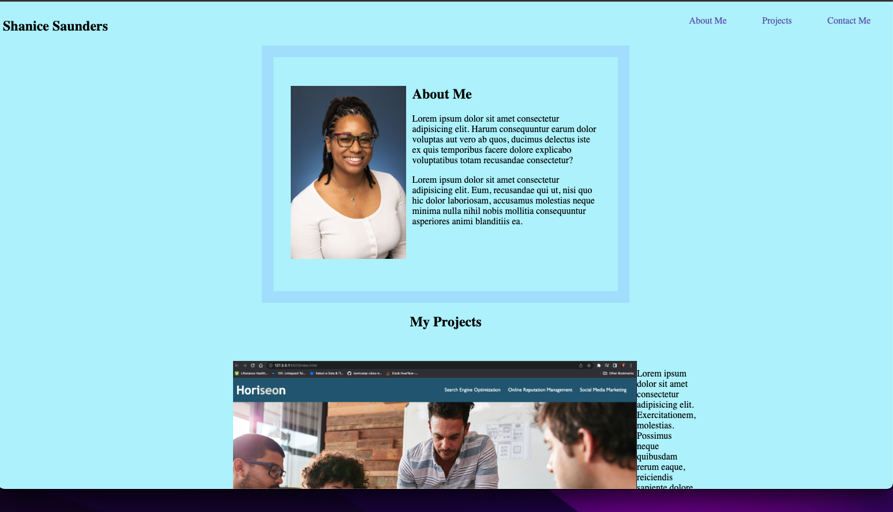

# hw-challenge2

# Description

In this week's challenge, we were tasked with creating our own online portfolio website. This is an important task because we can use this protfolio in the future when applying to jobs in the web development field. My portfolio is in it's very early stages of development. It has a very basic structure, with some stylying details added as well. 

The portfolio site has a couple of clickable links to external sites. The site also has some buttons added in for fun. Titles were placed on each image that you can see when you hover over them. The nav and footer elements change color as you hover them. The first project has a larger image then the other two and can be clicked on.

